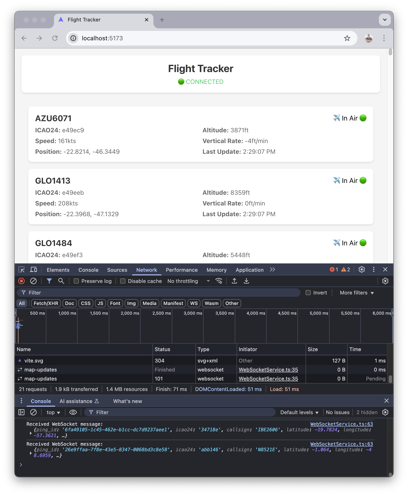

# Flight Tracker Event App

[](https://vitejs.dev/)
[](https://nodejs.org/)
[](https://www.typescriptlang.org/)
[](https://reactjs.org/)

A real-time flight tracking application built with React and TypeScript, following Domain-Driven Design principles.

  

## Tech Stack

- Node.js 20.18
- npm 10.8
- TypeScript
- React
- Vite
- WebSocket
- Styled Components

## Project Structure

The project follows a feature-based Domain-Driven Design approach where each feature is organized in its own directory with DDD layers:

```
src/
├── flights/                # Flight tracking feature
│   ├── ui/                 # Presentation components
│   ├── application/        # Use cases and services
│   ├── domain/             # Entities and value objects
│   └── infrastructure/     # External services and adapters
├── shared/                 # Shared utilities and components
└── App.tsx                 # Application entry point
```

Each feature follows the DDD layered architecture:
- **UI Layer**: React components and hooks
- **Application Layer**: Services and use cases that orchestrate domain logic
- **Domain Layer**: Business entities, value objects, and core business rules
- **Infrastructure Layer**: External services, repositories, and technical implementations

## Getting Started

### Prerequisites

- Node.js 20.18 or higher
- npm 10.8 or higher

### Installation

1. Clone the repository:
```bash
git clone git@github.com:luismr/flight-tracker-event-app.git
cd flight-tracker-event-app
```

2. Install dependencies:
```bash
npm install
```

3. Create a `.env` file in the project root with your WebSocket configuration:
```env
VITE_WEBSOCKET_URL="ws://localhost:8080/map-updates"
VITE_WEBSOCKET_RECONNECT_INTERVAL=5000
VITE_WEBSOCKET_MAX_RETRIES=5
```

4. Start the development server:
```bash
npm run dev
```

The application will be available at `http://localhost:5173`

## Building for Production

```bash
npm run build
```

The built files will be in the `dist` directory.

## Contributing

We welcome contributions! Here's how you can help:

1. Fork the repository
2. Create your feature branch:
```bash
git checkout -b feature/amazing-feature
```
3. Commit your changes:
```bash
git commit -m 'Add some amazing feature'
```
4. Push to the branch:
```bash
git push origin feature/amazing-feature
```
5. Open a Pull Request

Please make sure to:
- Follow the existing code style
- Add tests if applicable
- Update documentation as needed

## License

This project is licensed under the MIT License - see the [LICENSE.md](LICENSE.md) file for details. 